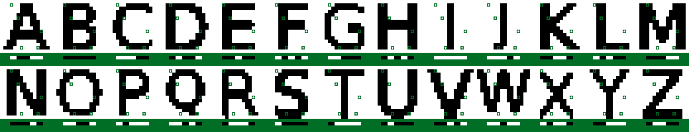
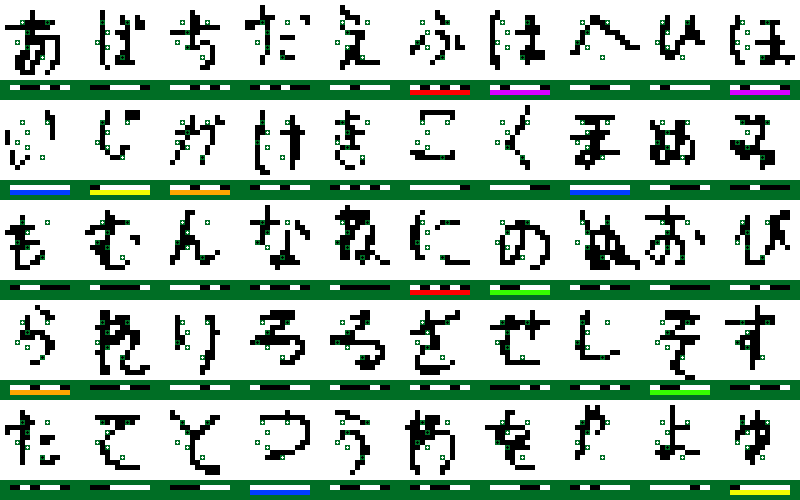

# Protokol k semestrální práci z BI-ZUM

FIT ČVUT, LS 2022/2023

Jméno: Patrik Drbal

Username: drbalpat

Název semestrální práce: OCR (Optical Character Recognition) snadno a rychle

OSNOVA
1. [Zadání semestrální práce](#zadání-semestrální-práce)
2. [Analýza problému](#analýza-problému)
3. [Výběr metody](#výběr-metody)
4. [Popis aplikace metody na problém](#popis-aplikace-metody-na-problém)
5. [Implementace](#implementace)
6. [Shrnutí a výsledky](#shrnutí-a-výsledky)
7. [Reference](#reference)

---

## Zadání semestrální práce

Mějme znaky nějaké abcedy jako obrázky, například velikosti 16x16 ve stupních šedi. Vaším úkolem je najít pozice několika pixelů tak, aby bylo možné podle hodnot těchto pixelů znaky abecedy od sebe rozeznat. Pro abecedu s 26 znaky s černo-bílými obrázky by teoreticky mělo stačit 5 pixelů, protože hodnoty v těchto pixelech mohou nabývat celkem 25 = 32 různých kombinací, což je více než 26.

- Pokuste se úlohu vyřešit pro latinskou abecedu.
- Najděte co nejmenší počet bodů, podle nichž jste schopni rozpoznávat znaky jedné z japosnký abeced, a sice hiraganu.

## Analýza problému

Začněme analýzou varianty s latinkou, která má 26 znaků,
tedy potřebujeme alespoň 5 bitů k jednoznačné identifikaci každého ze znaků.
Každý znak je reprezentován obrázkem o velikosti 16 x 16 = 256 pixelů,
kde každý pixel nabývá pouze hodnot #000000, nebo #FFFFFF.
Můžeme tedy ztotožnit bity s pixely.
Dohromady dostáváme, že je celkem "256 nad 5" kombinací, jak vybrat příslušných 5 pixelů,
tedy 8 809 549 056 kombinací, tedy necelých 9 miliard.

Analýza pro variantu s hiraganu je analogická, s tím, že
kombinací pro potřebných 6 pixelů je přes 368 miliard.

## Výběr metody

Vyzkoušet hrubou silou všechny kombinace nepřipadá kvůli velikosti stavového prostoru v úvahu.
Algoritmy systematického prohledávání (A*) také nejsou přímočaře použitelné,
jelikož není jasné, jak by řešení mělo být postupně konstruováno.

Nabízí se tedy použít nějaký z algoritmů nesystematického (lokálního) prohledávání.
Já jsem v této práci implementoval následující algoritmy:
- steepest ascent variantu Hill climbing algoritmu s restarty
- Simulované žíhání s pravděpodobnostní funkcí z přednášky a s lineárním ochlazováním
- steepest ascent vatiantu Tabu search algoritmu

## Popis aplikace metody na problém

Všechny tři algoritmy jsou aplikovány obdobně.
Kandidáty na (optimální) řešení jsou dané n-tice pixelů;
funkce, která se optimalizuje (minimalizuje),
je počet nejednoznačností při identifikaci symbolů pomocí těchto pixelů;
a množina sousedů, ze které se vybírá další kandidát,
je množina, kde se každý z pixelů původního kandidáta přesune na jiné libovolné
ještě neobsazené místo, zatímco ostatní pixely zůstanou na svém místě.

## Implementace

Každý z obrázků si ukládám do paměti jako vektor barev (černá/bílá)
a tyto vektory pro všechny obrázky daného datasetu  mám uložené ve vektoru `imageVectors`.
Minimalizační funkce je metoda `calculateCollisions` a sousedi se hledají metodou `candidateNeighbors`.
Při výpočtu sousedů se automaticky zahazuji pixely,
které mají stejnou hodnotu v každém z obrázků, a tedy nenesou v našem kontextu žádnou
užitečnou informaci.
Znalost těchto pixelů mám uloženou ve vektoru `mask`.

V případě Hill climbingu v každé iteraci kontroluji,
jestli nenastalo uváznutí v lokálním minimu a pokud ano, hledání restartuji.
K restartům typicky dochází již po několika málo iteracích, protože se ve stavovém prostoru
nachází mnoho lokálním extrémů.

Během Simulovaného žíhání začínám s teplotou 2 a v každém kroku lineárně zchladím o 0,00001.
Zkoušel jsem různé počáteční teploty i různé způsoby ochlazování,
ale tyto parametry vedly k nejlepším výsledkům.

Pro Tabu search jsem zvolil velikost tabu listu 200.

## Shrnutí a výsledky

Následuje výčet nejlepších výsledků, kterých se mi podařilo dosáhnout.
Každý z algoritmů běžel v součtu vždy několik hodin
a lepší výsledky níže prezentované nenašly.
Co víc, všech níže prezentovaných výsledků jsem dosáhl nezávisle na sobě pomocí dvou,
nebo dokonce všech tří algoritmů.
Asi nejvíce se osvědčil algoritmus Tabu search, poté Hill climbing a
nejhůře si vedlo Simulované žíhání.
Věřím, že při pečlivější přípravě parametrů pro Simulované žíhání by si tato metoda vedla lépe.

V následujícím popisu uvažuji souřadný systém, kde bod (0, 0) se nachází v levém horním rohu,
první souřadnice udává svislou polohu a druhá souřadnice vodorovnou polohu.

### Výsledky pro latinku

| # PIXELŮ | # KOLIZÍ | BODY                                               | POZNÁMKA                                          |
|----------|----------|----------------------------------------------------|---------------------------------------------------|
| 5        | 0        | (5, 5) (9, 12) (14, 6) (14, 11) (1, 3) | Vizualizováno v obrázku níže                      |
| 5        | 0        | (5, 5) (9, 12) (13, 6) (14, 11) (1, 3) | Liší se pouze prostřední bod                      |
| 5        | 0        | -                                                  | Několik dalších bezkolizních řešení bylo nalezeno |

Na obrázku níže jsou zobrazené jednotlivé znaky latinky
spolu s příslušnými body řešení.
Pod každým znakem je také vizualizace hodnot bodů řešení pro daný znak.

### Výsledky pro hiragana

| # PIXELŮ | # KOLIZÍ | BODY                                                                             | POZNÁMKA                                                                                                 |
|----------|----------|----------------------------------------------------------------------------------|----------------------------------------------------------------------------------------------------------|
| 6        | 7        | (6, 5) (11, 8) (4, 9) (9, 5) (8, 3) (4, 4)                        | Vizualizováno v obrázku níže Tento výsledek a žádný jiný jsem nalezl pomocí všech tří použitých metod |
| 7        | 1        | (6, 5) (3, 9) (8, 4) (5, 6) (6, 7) (11, 7) (4, 4)              | Tento výsledek a žádný jiný jsem nalezl pomocí metod Hill climbing a Tabu search                         |
| 8        | 0        | (4, 6) (10, 9) (11, 5) (4, 4) (8, 4) (8, 5) (11, 10) (3, 7) | Bezkolizní řešení pro 8 pixelů bylo nalezeno téměř okamžitě a takových řešení existuje více              |

Obdobný obrázek jako pro latinku, kolize jsou vyznačeny barevnými pruhy pod příslušnými znaky.

## Reference

Při zpracovávání této semestrální práce
jsem využíval jen techniky a algoritmy vyučované v předmětu BI-ZUM,
případně v jiných předmětech vyučovaných na FITu.
